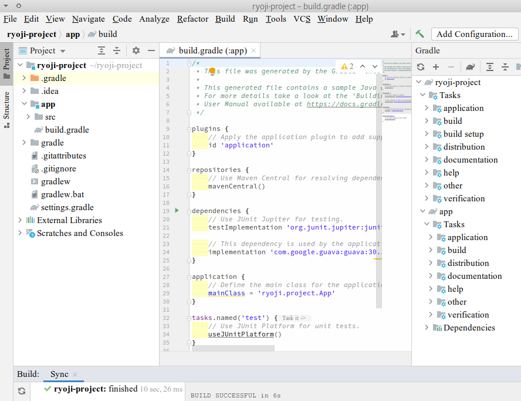
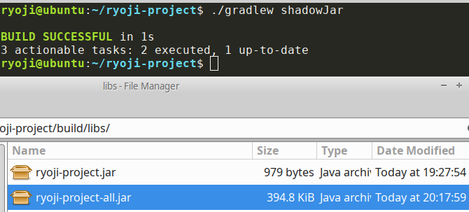

graalvmを使ってNative image化する場合には [temp-java-picocli-shadow-graalvm/tree/graalvm](https://github.com/growingspaghetti/temp-java-picocli-shadow-graalvm/tree/graalvm) ブランチのページへ。もっとも、2021年7月の現状ではWindowsでは無理なよう。

1. sdkmanを使ってGradleをインストール
2. gradle initを使って、プロジェクト雛形を作成
3. picocliプラグインを導入
4. --versionまたは-vでgitタグからバージョン情報を表示させる
5. catコマンド、wgetコマンドをjavaで書く
6. shadowプラグインを導入して配布する

# 1. sdkmanを使ってGradleをインストール

もしもsdkmanがまだインストールされていなかったら[https://sdkman.io/install](https://sdkman.io/install)でインストール。

その後、インストール可能なgradleのバージョン候補を列挙して、

<pre><font color="#A6E22E"><b>ryoji@ubuntu</b></font>:<font color="#66D9EF"><b>~</b></font>$ sdk list gradle
================================================================================
Available Gradle Versions
================================================================================
&gt; * 7.1.1               5.6.3               4.4                 2.6            
7.1                 5.6.2               4.3.1               2.5            
7.0.2               5.6.1               4.3                 2.4            
7.0.1               5.6                 4.2.1               2.3            
7.0                 5.5.1               4.2                 2.2.1          
6.9                 5.5                 4.1                 2.2            
6.8.3               5.4.1               4.0.2               2.1</pre>

最新のものをインストール、利用バージョンとして選択。

<pre><font color="#A6E22E"><b>ryoji@ubuntu</b></font>:<font color="#66D9EF"><b>~</b></font>$ sdk install gradle 7.1.1

gradle 7.1.1 is already installed.</pre>

<pre><font color="#A6E22E"><b>ryoji@ubuntu</b></font>:<font color="#66D9EF"><b>~</b></font>$ sdk use gradle 7.1.1

Using gradle version 7.1.1 in this shell.
</pre>

# 2. gradle initを使って、プロジェクト雛形を作成

- 以下、一連のdiffはここから見れる: https://github.com/growingspaghetti/temp-java-picocli-shadow-graalvm/commits/pure-java
- 雛形作成後のソース: https://github.com/growingspaghetti/temp-java-picocli-shadow-graalvm/releases/tag/v0.1.0

順序は、まず、プロジェクトのフォルダ作成し、次にその中で`gradle init`し、最後にそれを変更する。

<pre><font color="#A6E22E"><b>ryoji@ubuntu</b></font>:<font color="#66D9EF"><b>~/ryoji-project</b></font>$ gradle init
Starting a Gradle Daemon, 1 incompatible Daemon could not be reused, use --status for details

Select type of project to generate:
  1: basic
  2: application
  3: library
  4: Gradle plugin
Enter selection (default: basic) [1..4] 2

Select implementation language:
  1: C++
  2: Groovy
  3: Java
  4: Kotlin
  5: Scala
  6: Swift
Enter selection (default: Java) [1..6] 3

Split functionality across multiple subprojects?:
  1: no - only one application project
  2: yes - application and library projects
Enter selection (default: no - only one application project) [1..2] 1

Select build script DSL:
  1: Groovy
  2: Kotlin
Enter selection (default: Groovy) [1..2] 1

Select test framework:
  1: JUnit 4
  2: TestNG
  3: Spock
  4: JUnit Jupiter
Enter selection (default: JUnit Jupiter) [1..4] 4

Project name (default: ryoji-project): 
Source package (default: ryoji.project): 

<b>&gt; Task :init</b>
Get more help with your project: https://docs.gradle.org/7.1.1/samples/sample_building_java_applications.html

<font color="#A6E22E"><b>BUILD SUCCESSFUL</b></font> in 39s
2 actionable tasks: 2 executed</pre>



プロジェクトのフォルダをIntelliJで`ファイル > 開く`したところ。

gradleプロジェクトの中にgradleプロジェクトが入っている二重構造になっていて、この複雑さは不要なのでいらないものを削除する。これは少し面倒くさい。

1. appの下にあるものを全て上のフォルダに移して、appディレクトリは削除する。
   ```shell
   mv app/* .
   rm -r app
   ```
2. settings.gradleのincludeの行を消す。
3. build.gradleの`id 'application'`を`id 'java'`に変更、`implementation 'com.google.guava:guava:30.1-jre'`を消して、`application {}`のブロックも消す。
4. 以下を追加
   ```groovy
    java {
        toolchain {
            languageVersion = JavaLanguageVersion.of(11)
        }
    }
   ```
4. Gradleリフレッシュボタンを押す。<br>
   

# 3. picocliプラグインを導入
build.gradleのdependenciesに以下を追加。
```
    implementation 'info.picocli:picocli:4.6.1'
    annotationProcessor 'info.picocli:picocli-codegen:4.6.1'
```
この情報は次のウェブサイトで書かれています。
- https://remkop.github.io/presentations/20191123/index.html
- https://kazuhira-r.hatenablog.com/entry/2020/03/07/013626
- https://mike-neck.hatenadiary.com/entry/2020/04/24/090000

# 4. --versionまたは-vでgitタグからバージョン情報を表示させる
build.gradleのpluginsに以下を追加。
```
    id 'com.gorylenko.gradle-git-properties' version '2.2.4'
```
AppにshowVersion()機能を追加。
```java
    private void showVersion() {
        URL u = this.getClass().getResource("/git.properties");
        try (InputStream input = Objects.requireNonNull(u).openStream()) {
            Properties prop = new Properties();
            prop.load(input);
            System.out.println("Version: " + prop.getProperty("git.tags"));
            System.out.println("Commit id: " + prop.getProperty("git.commit.id"));
        } catch (IOException ex) {
            ex.printStackTrace();
        }
    }
```
gradle.propertiesを追加。`org.gradle.jvmargs=--illegal-access=permit`を指定。


写真の緑の三角のところから「Modify Run Configuration...」を選択し、argumentsに`-v`を入れる。


緑の三角のところからアプリを実行、gitの情報が表示されている。

# 5. catコマンド、wgetコマンドをjavaで書く
Cat.javaとWget.javaを作り、App.javaの`subcommands`のところを編集。

# 6. shadowプラグインを導入して配布する

https://github.com/growingspaghetti/temp-java-picocli-shadow-graalvm/releases/tag/v0.2.0

build.gradleのpluginsに以下を追加。
```
    id 'com.github.johnrengelman.shadow' version '7.0.0'
```

```goovy
jar {
    manifest {
        attributes "Main-Class": "ryoji.project.App"
    }
}
```
も追加。

これは次のファイル構成と一致していないとならない。


以上を終えると、`./gradlew shadowJar`のコマンドで実行可能Jarファイルを生成でき、それをコピーして配布すればいい。-allじゃない方はいらない。



<pre><font color="#A6E22E"><b>ryoji@ubuntu</b></font>:<font color="#66D9EF"><b>~/ryoji-project</b></font>$ git tag v0.1.0 be7260a14a6805a790409f15518a5e41e604bf89
<font color="#A6E22E"><b>ryoji@ubuntu</b></font>:<font color="#66D9EF"><b>~/ryoji-project</b></font>$ git tag v0.2.0 a497c2a852a40b929965afb29e8d954a2bab3501
<font color="#A6E22E"><b>ryoji@ubuntu</b></font>:<font color="#66D9EF"><b>~/ryoji-project</b></font>$ ./gradlew shadowJar

<font color="#A6E22E"><b>BUILD SUCCESSFUL</b></font> in 1s
3 actionable tasks: 2 executed, 1 up-to-date
<font color="#A6E22E"><b>ryoji@ubuntu</b></font>:<font color="#66D9EF"><b>~/ryoji-project</b></font>$ java -jar ./build/libs/ryoji-project-all.jar -h
Usage: <b>app</b> [<font color="#F4BF75">-hv</font>] [COMMAND]
  <font color="#F4BF75">-h</font>, <font color="#F4BF75">--help</font>      show this help
  <font color="#F4BF75">-v</font>, <font color="#F4BF75">--version</font>   show version
Commands:
  <b>cat</b>
  <b>wget</b>
<font color="#A6E22E"><b>ryoji@ubuntu</b></font>:<font color="#66D9EF"><b>~/ryoji-project</b></font>$ java -jar ./build/libs/ryoji-project-all.jar -v
Version: v0.2.0
Commit id: a497c2a852a40b929965afb29e8d954a2bab3501
<font color="#A6E22E"><b>ryoji@ubuntu</b></font>:<font color="#66D9EF"><b>~/ryoji-project</b></font>$ java -jar ./build/libs/ryoji-project-all.jar cat .gitignore
# Ignore Gradle project-specific cache directory
.gradle

# Ignore Gradle build output directory
build

# idea project settings
.idea
<font color="#A6E22E"><b>ryoji@ubuntu</b></font>:<font color="#66D9EF"><b>~/ryoji-project</b></font>$ java -jar ./build/libs/ryoji-project-all.jar wget https://sdkman.io/assets//img/logo.png
</pre>
